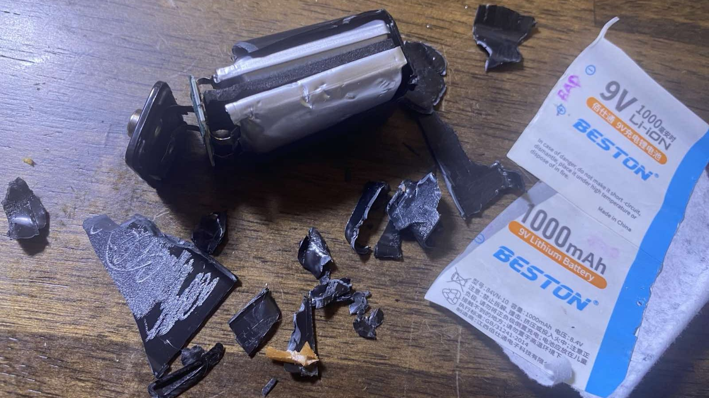
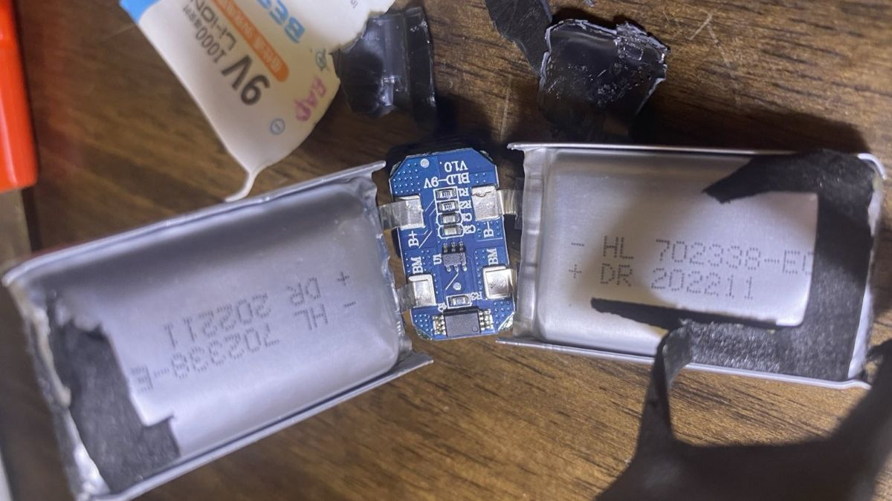
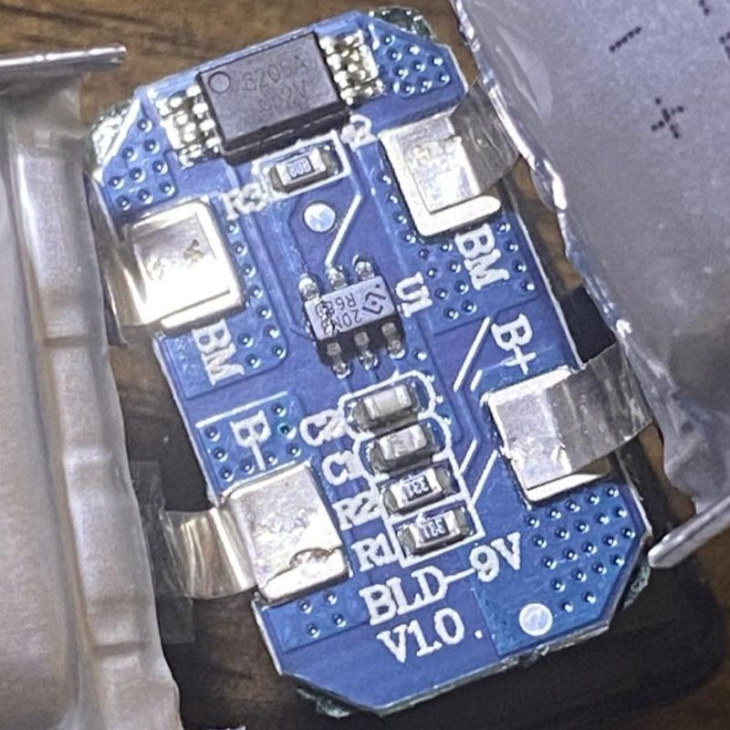
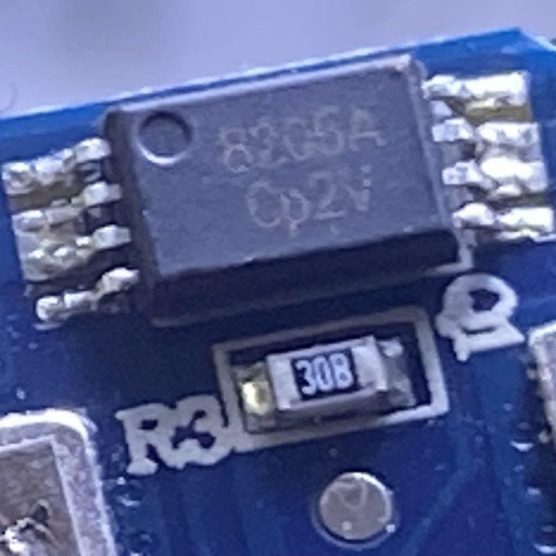

# Beston 9 Volt LiPo Battery

Investigating and documenting the inside of a 9V LiPo block battery replacement.

## Circuit

The 8205A is a dual N-channel MOSFET (two MOSFETs in a single 8-pin package). It acts as the main power switch for the battery pack — one MOSFET controls charge, the other controls discharge. When the protection IC detects an unsafe condition, it cuts the gate voltage to one or both FETs, disconnecting the battery from the output.

The 20N R68 (6-pin package) is the protection IC — this is the brain of the circuit, likely a DW01A or equivalent single-cell (or dual-cell) Li-ion/LiPol protector. It continuously monitors cell voltage and current. It signals the 8205A to open when it detects overvoltage (typically ~4.25–4.35V per cell), undervoltage (~2.5–3.0V per cell), or overcurrent/short circuit.

The 30B resistor is the current sense resistor. It's a very low value (the "B" suffix in some Asian component markings = milliohms range, often 0.030Ω). The protection IC measures the tiny voltage drop across it to detect overcurrent or short circuit conditions.

Since you have two LiPol packs inside, they are most likely wired in series to produce the 9V nominal output (two ~4.2V cells = ~8.4V full charge, which is close enough to be marketed as "9V").

The color-coded paths:

- **Amber** — the positive/discharge path running from B+ through the protection IC, through the 8205A, to the output terminal
- **Blue** — the negative/return path, which passes through the 30B sense resistor on its way back to B−
- **Green dashed** — the gate control signals from the protection IC to the two MOSFETs inside the 8205A
- **Gray** — the internal cell-to-cell series connection

Here's how the three stages work together in normal operation:

**During discharge** (powering a device): current flows from B+ → protection IC monitoring lines → through the 8205A's discharge FET → to the output. The 20N R68 watches cell voltage via B+ and B−, and monitors current via the voltage drop across the 30B sense resistor. If a cell drops below ~2.5V or current spikes (short circuit), it pulls the DSG gate low, the FET opens, and the output is cut.

**During charging**: current flows in reverse through the 8205A's charge FET. The IC watches for overvoltage (~4.25V per cell). If either cell exceeds this, it cuts the CHG gate, stopping charge. This protects the cells from thermal runaway.

**The 30B sense resistor** sits in the B− path between the cells and the IC ground reference. At 0.030Ω, even a few amps of overcurrent produces a measurable millivolt signal the IC uses to trip the protection in microseconds.

The "9V" label is a slight marketing stretch — two LiPol cells in series give 8.4V fully charged and around 7.0–7.4V nominal, but 9V carbon-zinc equivalents also sag heavily under load, so the chemistry is considered compatible for most applications.

## Images of the physical devices, disassembled

 

 

## Electronic devices

### 20N R68 protection IC

- [Datasheet DW01A-X](docs/DW01X.PDF) from Fortune, rev 1.7, 19 pages, 05/2014, 882 KB
- [Datasheet DW01A](docs/DW01A.PDF) from H&M semi, 7 pages, 05/2004, 1270 KB

### 8205A is a dual N-channel MOSFET

- [Datasheet](docs/8205A_KIA.PDF) from KIA Semiconductors, 5 pages, v1.1 12/2015, 223 KB
- [Datasheet](docs/8205A_VBsemi.PDF) from VBsemi.tw, 8 pages, 869 KB
- [Datasheet](docs/8205A.PDF) from unclassified manufacturer in China, 7 pages, 10/2023, 535 KB
